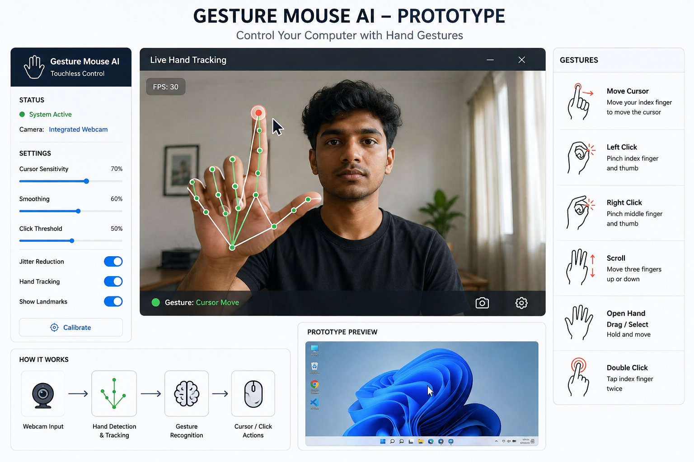

# 🖱️ AI Gesture Mouse

<div align="center">

[](https://www.python.org/)
[](https://opencv.org/)
[](https://developers.google.com/mediapipe)
[](https://pyautogui.readthedocs.io/)
[](LICENSE)
[](https://youtu.be/F9Yy4gpLEBk?si=3HNrJborli19yi6s)

**A high-precision, software-only, AI-powered touchless mouse interface using computer vision and natural hand gestures.**

[Features](#-key-features) • [Gesture Guide](#-gesture-guide) • [Installation](#-installation--quickstart) • [Calibration](#-interactive-calibration) • [Architecture](#-architecture) • [Roadmap](#-project-roadmap) • [Team](#-team-new-moon)

</div>

---

<p align="center">
  
</p>

---

## 🌟 Executive Summary

**Gesture Mouse AI** is a software-only, AI-powered touchless mouse that allows users to seamlessly navigate and control their computer using only a standard built-in or USB webcam and natural hand gestures.

Traditional input devices create accessibility barriers for individuals with limited fine-motor mobility, introduce hygiene and transmission risks in shared touch environments (hospitals, public kiosks, clinics), and create friction for presenters and educators in classrooms.

Unlike existing solutions (such as Leap Motion or specialized depth/infrared sensor rigs) which require costly proprietary hardware, **Gesture Mouse AI** is:
- 💡 **100% Software-Only**: Runs on standard RGB webcams found in laptops.
- ⚡ **Zero Setup Cost**: Instant, free deployment for students, educators, and institutions.
- 🎯 **High Precision**: Google MediaPipe 21 3D hand-landmark tracking combined with Exponential Moving Average (EMA) jitter suppression.
- 🖐️ **Rich Gesture Vocabulary**: Cursor movement, left-click, right-click, double-click, drag-and-drop, and vertical scrolling.

---

## 🚀 Key Features

- **Real-Time Landmark Detection**: Tracks 21 3D hand landmarks in real time with high frame rates using Google MediaPipe.
- **Jitter-Free Exponential Smoothing (EMA)**: Proprietary deadzone and EMA filtering eliminate micro-tremors and unsteady hand movements.
- **Natural Ergonomic Gestures**: Intuitive mapping designed around human hand anatomy.
- **Live HUD & Visual Telemetry**: Heads-Up Display showing the active bounding area, current gesture state, real-time FPS counter, and animated click rings.
- **Interactive Calibration Utility**: Built-in tool to measure your rest pinch distance, tune pointer sensitivity, and save preferences to `config.json`.
- **Modular & Extensible Architecture**: Clean OOP design decoupled into detector, controller, state machine, and configuration modules.

---

## 🖐️ Gesture Guide

Detailed descriptions and trigger mechanisms for each supported gesture:

| Gesture Action | Hand Landmark Pose | How It Works |
| :--- | :--- | :--- |
| **Move Cursor** | ☝️ **Index finger UP**, other fingers folded | The tip of your index finger is tracked and smoothly mapped across screen coordinates. |
| **Left Click** | 🤏 **Pinch Thumb & Index finger** | Bringing the thumb and index finger together (< 38px) performs a single left click. |
| **Right Click** | 🖐️ **3 Fingers UP** (Index, Middle, Ring UP) | Raising three fingers triggers a context/right click with a 0.35s debounce cooldown. |
| **Double Click** | ✌️ **Thumb & Middle finger pinch** | Tapping thumb and middle finger while index is up executes a double click. |
| **Drag & Drop** | ✊ **Pinch & Hold** (> 0.45s) | Pinching and holding keeps the mouse button down; move to drag and release to drop. |
| **Scroll Up / Down**| ✌️ **2 Fingers UP** (Peace Sign) | Moving two fingers vertically scrolls documents, web pages, and presentation slides. |
| **Neutral / Idle** | ✊ **Fist / No fingers extended** | System pauses cursor movement to allow resting your hand without accidental inputs. |

> 📖 *For comprehensive documentation and tips on lighting and camera placement, see [docs/GESTURE_GUIDE.md](docs/GESTURE_GUIDE.md).*

---

## 🛠️ Tech Stack

- **Language**: Python 3.9+
- **Computer Vision**: OpenCV (v4.8+)
- **Hand Landmark ML**: Google MediaPipe (v0.10+)
- **Input Automation**: PyAutoGUI & pynput
- **Scientific Computing**: NumPy
- **Testing & Quality**: pytest & flake8

---

## 💻 Installation & Quickstart

### 1. Clone the Repository
```bash
git clone https://github.com/Rajapakshaminindu/AI-Gesture-Mouse.git
cd AI-Gesture-Mouse
```

### 2. Create and Activate a Virtual Environment
```bash
# Windows
python -m venv .venv
.venv\Scripts\activate

# macOS / Linux
python3 -m venv .venv
source .venv/bin/activate
```

### 3. Install Required Dependencies
```bash
pip install -r requirements.txt
```

### 4. Launch AI Gesture Mouse
```bash
python -m src.main
```

> **Controls**:
> - Press **`q`** or **`ESC`** at any time to gracefully shut down the application.
> - To run with a specific external webcam: `python -m src.main --camera 1`
> - To hide HUD telemetry graphics: `python -m src.main --no-hud`

---

## 🎛️ Interactive Calibration

To customize the mouse sensitivity, active bounding area, or pinch threshold for your specific hand size and camera distance:

```bash
python -m src.calibration
```

| Key | Action |
| :--- | :--- |
| **`c`** | Sample current pinch distance and update threshold |
| **`+`** / **`-`** | Increase / decrease cursor smoothing factor |
| **`s`** | Save optimized settings to `config.json` |
| **`q`** / **ESC** | Exit calibration mode |

---

## 📐 Architecture

The AI Gesture Mouse processing pipeline:

```
[ Camera Frame ] 
       ↓
[ Mirroring & Preprocessing ]
       ↓
[ MediaPipe 21 Landmark Extraction ]
       ↓
       ├─→ [ Coordinate Interpolator + Deadzone + EMA Filter ] ──→ [ Cursor Position ]
       │                                                                   ↓
       └─→ [ Gesture Classifier State Machine + Cooldowns ]     ──→ [ Click / Drag / Scroll ]
                                                                           ↓
                                                            [ Operating System Desktop ]
```

Detailed technical design notes are available in [ARCHITECTURE.md](ARCHITECTURE.md).

---

## 🧪 Running Unit Tests

AI Gesture Mouse includes a comprehensive unit test suite covering landmark math, coordinate mapping, debounce timers, and gesture classification:

```bash
python -m pytest tests/ -v
```

Or using standard Python:
```bash
python -m unittest discover -s tests
```

---

## 🗺️ Project Roadmap

Developed as part of the **HackX 11.0 Inter-University Startup Challenge**:

- [x] **Phase 1 (MVP)**: Core MediaPipe hand tracking, smooth cursor movement, and click gestures.
- [x] **Phase 2**: Scroll, drag-and-drop, interactive calibration tool, and HUD telemetry.
- [ ] **Phase 3**: Multi-monitor desktop support, custom user-defined gesture binding GUI.
- [ ] **Phase 4**: Enterprise deployment packages for smart classrooms and touchless public kiosk installations.

---

## 🎥 Pitch Video

Check out our official HackX 11.0 Pitch Video demonstrating the vision and real-world impact:

🔗 **[Watch on YouTube: AI Gesture Mouse Pitch](https://youtu.be/F9Yy4gpLEBk?si=3HNrJborli19yi6s)**

---

## 👥 Team NEW MOON

**University of Kelaniya — HackX 11.0 Inter-University Startup Challenge**

| Member | Role | Email |
| :--- | :--- | :--- |
| **G.W.S.P. Mihirangi De Silva** | Team Leader | mihirangidesilva8@gmail.com |
| **R.G.M.J. Rajapaksha** | Core Developer / AI Engineering | rajapakshaminidu@gmail.com |
| **T.W. Dulana Chathurma** | System Design & QA | dulanachathurma99@gmail.com |
| **A.P.K. Gimshan** | Research & Product Strategy | kavindugimshan444@gmail.com |

---

## 📄 License

This project is licensed under the [MIT License](LICENSE).
