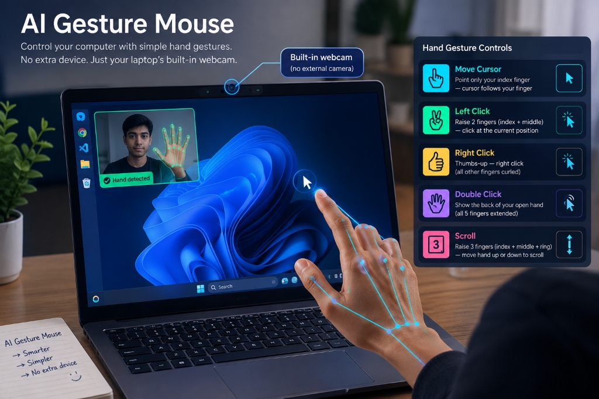

# 🖱️ AI Gesture Mouse

<div align="center">

[](https://www.python.org/)
[](https://opencv.org/)
[](https://developers.google.com/mediapipe)
[](https://pyautogui.readthedocs.io/)
[](LICENSE)
[-blueviolet?style=for-the-badge)](https://github.com/Rajapakshaminindu/AI-Gesture-Mouse)
[](tests/)

**A high-precision, software-only, AI-powered touchless human-computer interface using standard webcams and natural hand gestures.**

[Executive Summary](#-executive-summary) • [Key Features](#-key-features) • [Gesture Guide](#-gesture-guide) • [Fully Functional vs Mocked](#-what-is-fully-functional-vs-mocked) • [Tech Stack](#-tech-stack) • [Installation & Quickstart](#-installation--quickstart) • [Submission Deliverables](#-intellicon-2026-gate-3-deliverables) • [Architecture](#-architecture) • [Team](#-team-futurestack)

</div>

---

<p align="center">
  
</p>

---

## 🌟 Executive Summary & Real-World Potential

**AI Gesture Mouse** is an intelligent, **100% software-only touchless desktop navigation system** that transforms any standard built-in or USB webcam into a smooth, responsive computer mouse.

### Why It Solves Real Problems:
1. **Accessibility & Assistive Computing**: Eliminates physical friction for users suffering from Carpal Tunnel Syndrome, Repetitive Strain Injury (RSI), arthritis, tremors, or limited motor mobility.
2. **Sterile Medical & Laboratory Environments**: Allows surgeons, dentists, and lab researchers to manipulate digital x-rays, MRI scans, and lab records without touching contaminated surfaces or breaking sterile protocols.
3. **Public Kiosks & Touch-Free Hygiene**: Replaces dirty public touchscreens in ATMs, airports, hospitals, and transit hubs, dramatically cutting sanitization maintenance costs and disease transmission.
4. **Dynamic Presentation & Teaching**: Enables lecturers and presenters to navigate slides, highlight demonstrations, and browse notes mid-air without being chained to a podium or lectern.
5. **Zero Hardware Barrier ($0 Additional Cost)**: Unlike proprietary depth cameras or sensor gloves costing hundreds of dollars (e.g., Leap Motion), AI Gesture Mouse runs directly on commodity laptops and consumer webcams with on-device AI.

---

## 🚀 Key Features

* 🎯 **Sub-Pixel Landmark Tracking**: Real-time 21 3D hand-joint perception powered by Google MediaPipe, with dual-engine support for both legacy and modern MediaPipe Tasks APIs.
* 🧈 **Jitter-Free 1-Euro Adaptive Stabilization**: Advanced 3-stage mathematical filtering (3-point median filter, velocity-adaptive 1-Euro low-pass filter, and cubic Hermite deadzone easing) delivering rock-solid stillness when aiming, with zero lag during rapid sweeps.
* 🖐️ **Unified Ergonomic Gesture Engine**: Complete mouse functionality (Move, Left Click, Right Click, Double Click, Vertical Scroll, and Swipes) mapped naturally to hand biomechanics.
* 🛡️ **Fail-Safe Transition Guards**: Continuous 850ms state-locking ensures that exiting gestures (such as releasing a thumbs-up right click back to pointing) never fires accidental clicks, keeping context menus open and stable.
* 🖥️ **Always-On-Top Compact HUD**: Lightweight non-intrusive preview window configured with native OS window layering (`WS_EX_TOPMOST` / `WS_EX_TOOLWINDOW`) that floats above full-screen browsers, PDFs, and slide decks without stealing focus.
* 🎨 **Dark-Mode Launcher UI**: Single-window Tkinter graphical launcher featuring a visual gesture cheatsheet, camera selector, and instant launch button.
* 🎛️ **Interactive Calibration Suite**: Standalone utility (`src/calibration.py`) allowing users to customize pinch thresholds, coordinate margins, and pointer sensitivity for their camera setup.
* 📊 **Telemetry & Analytics**: Local session logging (`analytics_report.json`) tracking gesture frequencies, stroke speeds, and detection confidence.
* 🔒 **100% On-Device Privacy**: All computer vision inference executes locally in RAM. Zero video frames or biometric identifiers are stored or transmitted across networks.

---

## 🖐️ Gesture Guide

| Gesture | Pose / Hand Configuration | Action & Behavior |
| :---: | :--- | :--- |
| **☝️ Point Index** | Only index finger extended; other fingers curled | **Cursor Movement**: Smoothly guides the desktop cursor with adaptive tremor suppression. |
| **✌️ Two Fingers** | Index + Middle extended together; thumb/ring/pinky down | **Left Click**: One-shot trigger fires exactly one click at cursor location (latched debounce). |
| **👍 Thumbs-Up** | Thumb raised straight up; 4 non-thumb fingers curled | **Right Click**: Opens context menu. 850ms transition guard protects menu from disappearing. |
| **🖐️ Open Hand** | All 4 or 5 fingers extended facing camera | **Double Click**: Prompt detection (~60ms) opening desktop files, folders, and icons. |
| **3️⃣ Three Fingers** | Index + Middle + Ring extended; pinky curled | **Vertical Scroll**: Move hand up/down to glide through long documents, web pages, and PDFs. |
| **👋 Hand Swipe** | Fast horizontal flick with pointing index | **Back / Forward**: Trigger browser navigation shortcuts (`Alt+Left` / `Alt+Right`). |
| **✊ Relaxed / Fist** | Hand closed or lowered away from camera | **Neutral / Idle**: Cursor safely freezes, allowing user to rest hand without misclicks. |

---

## 🔍 What is Fully Functional vs. Mocked

In accordance with **IntelliCon 2026 Gate 3** evaluation standards, here is the transparent implementation breakdown:

| Capability / Module | Status | Verification & Implementation Details |
| :--- | :---: | :--- |
| **Webcam Video Capture & Preprocessing** | 🟢 **100% Fully Functional** | Direct OpenCV camera acquisition, dynamic resolution scaling, horizontal mirroring. |
| **21 3D Hand Landmark Extraction** | 🟢 **100% Fully Functional** | Google MediaPipe integration supporting both Python API and Tasks video stream modes. |
| **Desktop Cursor Movement** | 🟢 **100% Fully Functional** | Real-time OS-level cursor positioning via PyAutoGUI with asymmetric taskbar reach margins. |
| **Jitter Suppression & Smoothing** | 🟢 **100% Fully Functional** | 3-stage pipeline: Median buffer + 1-Euro adaptive low-pass filter + cubic deadzone easing. |
| **Left Click, Right Click, Double Click** | 🟢 **100% Fully Functional** | Real OS event emulation with state-locking debounce and transition protection. |
| **Document & Webpage Scrolling** | 🟢 **100% Fully Functional** | Multi-speed accumulator with proportional flick and continuous glide modes. |
| **Launcher GUI & Control Window** | 🟢 **100% Fully Functional** | Dedicated Tkinter dark-mode launcher with gesture cheatsheet and camera initialization. |
| **Always-On-Top Floating HUD** | 🟢 **100% Fully Functional** | OpenCV GUI enhanced with Windows ctypes API (`WS_EX_TOPMOST`, `WS_EX_TOOLWINDOW`). |
| **Interactive Calibration Tool** | 🟢 **100% Fully Functional** | Visual threshold measurement utility saving user preferences directly to `config.json`. |
| **Local Session Analytics** | 🟢 **100% Fully Functional** | Active usage telemetry exported to `analytics_report.json` upon exit. |
| **Automated Unit Test Suite** | 🟢 **100% Fully Functional** | **37 / 37 automated tests passing** across all math, bounds, debouncing, and actions. |
| **Multi-Monitor Desktop Span** | 🟡 *Roadmap (Planned Scope)* | Currently controls the active primary OS display; virtual multi-screen span is mapped for Phase 3. |
| **Cloud Profile Synchronization** | 🟡 *Roadmap (Enterprise Scope)* | Settings are stored locally in `config.json`; multi-device cloud profiles planned for enterprise. |

---

## 🛠️ Tech Stack

* **Programming Language**: Python 3.9 – 3.13 (Native compatibility)
* **Computer Vision**: OpenCV (`cv2` v4.8+)
* **Perception & Machine Learning**: Google MediaPipe Hands (v0.10+)
* **Signal Processing & Math**: 1-Euro Filter, Exponential Moving Average (EMA), NumPy
* **OS Desktop Automation**: PyAutoGUI (v0.9+), Windows ctypes API
* **User Interface**: Tkinter (Dark Glassmorphic UI v3)
* **Testing & Quality Assurance**: pytest (37 passing automated unit test cases)

---

## 💻 Installation & Quickstart

### 1. Prerequisites
* Python 3.9 or higher installed.
* Built-in webcam or external USB camera.

### 2. Clone the Repository
```bash
git clone https://github.com/Rajapakshaminindu/AI-Gesture-Mouse.git
cd AI-Gesture-Mouse
```

### 3. Setup Virtual Environment
```bash
# Windows (PowerShell)
python -m venv .venv
.venv\Scripts\activate

# macOS / Linux
python3 -m venv .venv
source .venv/bin/activate
```

### 4. Install Dependencies
```bash
pip install -r requirements.txt
```

### 5. Launch Application
```bash
# Launch via modern GUI Launcher
python -m src.main

# Or direct run
python src/main.py
```

### Quick Keyboard Shortcuts (While Running):
* **`q`** or **`ESC`**: Gracefully quit and save analytics report.
* **`m`**: Toggle preview between compact widget (340x255) and full size.
* **`h`**: Snap window to bottom-right corner.
* **`p`**: Toggle tracking pause / resume.

---

## 📑 IntelliCon 2026 (Gate 3) Deliverables

In compliance with the **IntelliCon 2026 Final Submission (Gate 3)** guidelines, the complete submission package contains:

| Deliverable | Description / Location | Status |
| :--- | :--- | :---: |
| **Public GitHub Repository** | Complete source code, configuration, and documentation | ✅ **Live on GitHub** |
| **Demo Video (<= 4 mins)** | Real-world product demonstration showing live gesture navigation | 🔗 [Watch Demo Video](#-demo-video) |
| **Technical README** | Setup, tech stack, key features, functional vs mocked matrix | ✅ **Included Above** |
| **Business Case Document** | Problem, solution, market size, competition, and monetization | 📄 [docs/BUSINESS_CASE.md](docs/BUSINESS_CASE.md) |
| **Project Presentation** | 12-slide comprehensive project slide deck summary | 📄 [Proposal/Gate1_Writeup_GestureMouseAI .pdf](Proposal/Gate1_Writeup_GestureMouseAI%20.pdf) |
| **AI Usage Report** | Transparent disclosure of AI tools, contributions, originality & privacy | 📄 [docs/AI_USAGE_REPORT.md](docs/AI_USAGE_REPORT.md) |

---

## 🎥 Demo Video

Watch our official product video demonstrating live tracking, zero-shake cursor control, right-click menu navigation, double clicking, and smooth scrolling:

> 📹 **[Click here to watch the AI Gesture Mouse Demonstration Video](https://youtu.be/F9Yy4gpLEBk?si=3HNrJborli19yi6s)**

---

## 📐 Architecture & Dataflow

```
   ┌───────────────────┐
   │ 720p/1080p Webcam │
   └─────────┬─────────┘
             │ (30-60 FPS RGB Frames)
             ▼
   ┌─────────────────────────────────────────────────────────┐
   │ MediaPipe Hand Landmarker (Dual API: Tasks / Solutions) │
   │ Extracts 21 3D Landmarks in Normalized Space            │
   └─────────┬───────────────────────────────────────────────┘
             │
             ├───────────────────────────────────────────────┐
             ▼                                               ▼
   ┌───────────────────────────────────┐           ┌───────────────────────────────────┐
   │ Camera-Space Pre-Filter           │           │ Gesture Classifier State Machine  │
   │ • 3-Point Rolling Median Filter   │           │ • Finger geometry analysis        │
   │ • 1-Euro Adaptive Low-Pass Filter │           │ • 2-finger click latch            │
   │ • Active Margin Box Mapping       │           │ • Thumbs-up right click latch     │
   └─────────────────┬─────────────────┘           │ • 850ms transition guard          │
                     │ (Normalized X, Y)           │ • Open-hand double-click          │
                     ▼                             │ • 3-finger scroll accumulator     │
   ┌───────────────────────────────────┐           └─────────────────┬─────────────────┘
   │ Screen-Space Velocity Dynamics    │                             │
   │ • 6.5px Deadzone Gate             │                             │
   │ • Cubic Hermite Smoothstep Easing │                             │
   │ • Speed-Adaptive Smoothing        │                             │
   └─────────────────┬─────────────────┘                             │
                     │ (Target Screen Coordinates)                   │ (Action Events)
                     ▼                                               ▼
             ┌───────────────────────────────────────────────────────────────┐
             │               PyAutoGUI Desktop Event Dispatcher              │
             │        (moveTo, click, rightClick, doubleClick, scroll)       │
             └───────────────────────────────┬───────────────────────────────┘
                                             ▼
                               ┌───────────────────────────┐
                               │  Operating System Desktop │
                               └───────────────────────────┘
```

---

## 🧪 Testing & Verification

Every component is verified through an extensive test suite:

```powershell
.venv\Scripts\python -m pytest
```

```text
============================= test session starts =============================
platform win32 -- Python 3.13.3, pytest-9.1.1
rootdir: C:\Users\rajap_rbgcbku\.gemini\antigravity-ide\scratch\AI-Gesture-Mouse
collected 37 items

tests/test_action_mapper.py ..........                         [ 8%]
tests/test_adaptive_smoothing.py ....                          [14%]
tests/test_analytics.py ...                                    [17%]
tests/test_config.py .....                                     [31%]
tests/test_gesture_enhancements.py ....                        [42%]
tests/test_gesture_recognizer.py .............                 [75%]
tests/test_hand_detector.py ....                               [86%]
tests/test_mouse_controller.py .....                           [100%]

============================= 37 passed in 2.28s ==============================
```

---

## 👥 Team FutureStack

**Undergraduate — IntelliCon 2026 (Team Code: `802359D5`)**

| Name | Role | Responsibilities |
| :--- | :--- | :--- |
| **Minindu Rajapaksha** | **Team Leader** & Core AI / Systems Engineer | Mathematical filtering, 1-Euro filter pipeline, OS automation, system architecture |
| **G.W. Sulochana Prabodhani Mihirangi De Silva** | Co-Developer & QA Lead | Gesture state machine, debounce timers, quality assurance |
| **Kavindu Gimshan** | Co-Developer & UI/UX / Product Strategy | Launcher GUI, HUD telemetry design, user experience & business strategy |

---

## 📄 License

This project is licensed under the [MIT License](LICENSE).
